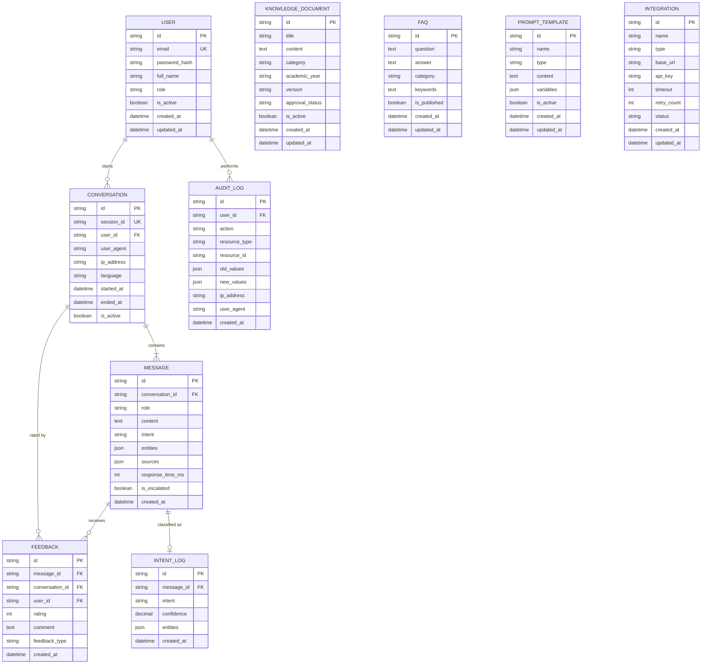
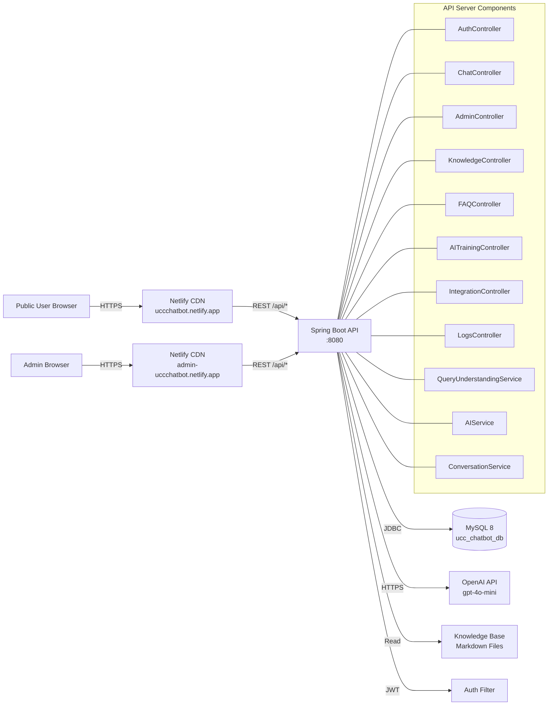

# UCC AI Assistant — Project Report

## 1. Executive Summary

The **University of Dar es Salaam Computing Centre (UCC) AI Assistant** is an intelligent, multilingual customer-care chatbot designed to help prospective students, current students, and the public discover accurate information about UCC's academic programmes, professional courses, admissions, fees, IT services, and software products. The system runs 24/7, supports English and Kiswahili, and operates under the official identity of **"UCC AI Assistant"** — a neutral, professional, institutional persona.

**Live system:**
- **Frontend (Chatbot):** https://agent-6a87a4d1bce5537b6d8d53a5--uccchatbot.netlify.app/
- **Admin Dashboard:** https://admin-uccchatbot.netlify.app/

---

## 2. Problem Statement

Before the chatbot, UCC handled enquiries manually through phone calls, emails, and walk-ins. This led to:
- Long response times during peak admission periods
- Inconsistent answers across staff
- Limited Kiswahili support
- Difficulty tracking enquiry patterns and common questions
- Heavy load on admissions and customer-service staff

The chatbot addresses these by providing instant, accurate, multilingual responses grounded in the official UCC knowledge base, while freeing staff to focus on complex enquiries.

---

## 3. Objectives

1. Provide instant 24/7 responses to UCC-related enquiries
2. Support both **English** and **Kiswahili** seamlessly
3. Maintain a premium, charming customer-care tone
4. Feed the system with accurate, verified information directly from https://ucc.co.tz/
5. Provide an admin dashboard for knowledge-base management, conversation monitoring, AI training, API integrations, and system logs
6. Track user satisfaction and continuously improve responses
7. Deliver a full, working production system deployed on the public internet

---

## 4. System Architecture

The system follows a **three-tier architecture**:

| Tier | Component | Technology |
|------|-----------|------------|
| **Presentation** | Frontend Chatbot, Admin Dashboard | HTML, CSS, Vanilla JavaScript, Netlify hosting |
| **Application** | REST API backend | Java 17, Spring Boot 3.3.4, Spring Security, JWT |
| **Data** | Database, file storage | MySQL 8, knowledge-base Markdown files |

### 4.1 Architecture Diagram

```
┌──────────────────────────────────────────────────────────────┐
│                        USERS                                │
│  ┌─────────────────┐              ┌──────────────────────┐  │
│  │  Public Visitor │              │  UCC Admin Staff     │  │
│  │  (Browser)      │              │  (Browser)           │  │
│  └────────┬────────┘              └──────────┬───────────┘  │
└───────────┼─────────────────────────────────┼───────────────┘
            │                                  │
            ▼                                  ▼
┌───────────────────────┐          ┌──────────────────────────┐
│  Netlify (Frontend)   │          │  Netlify (Admin Panel)   │
│  uccchatbot.netlify   │          │  admin-uccchatbot        │
│  Static HTML/CSS/JS   │          │  Static HTML/CSS/JS      │
└───────────┬───────────┘          └────────────┬─────────────┘
            │                                   │
            └─────────────┬─────────────────────┘
                          │ HTTPS / REST
                          ▼
        ┌──────────────────────────────────────────┐
        │   Java Spring Boot API Server            │
        │   - AuthController (JWT login)           │
        │   - ChatController (chat + health)       │
        │   - AdminController (dashboard stats)    │
        │   - KnowledgeController (CRUD + upload)  │
        │   - FAQController (CRUD)                 │
        │   - AITrainingController (prompts)       │
        │   - IntegrationController (CRUD + test)  │
        │   - LogsController (audit logs)          │
        │   - QueryUnderstandingService (NLP)      │
        │   - AIService (static KB + OpenAI LLM)   │
        │   - KnowledgeService (retrieval)         │
        │   - ConversationService                 │
        └────────┬─────────────────────────────────┘
                 │
        ┌────────┼────────────────┐
        ▼                         ▼
┌──────────────┐         ┌──────────────────────┐
│  MySQL 8     │         │  OpenAI API          │
│  ucc_chatbot │         │  (gpt-4o-mini +      │
│  _db         │         │   text-embedding)    │
└──────────────┘         └──────────────────────┘
```

---

## 5. Use Case Diagram

```mermaid
graph TB
    Visitor[👤 Public Visitor]
    Admin[👨‍💼 UCC Admin Staff]
    SuperAdmin[👨‍💼 Super Admin]

    subgraph "UCC Chatbot System"
        UC1[Ask about programmes]
        UC2[Ask about admissions]
        UC3[Ask about fees]
        UC4[Ask about contact info]
        UC5[Ask in Kiswahili]
        UC6[Rate response]
        UC7[Login to admin panel]
        UC8[Manage knowledge base]
        UC9[Manage FAQs]
        UC10[Manage AI prompts]
        UC11[Manage API integrations]
        UC12[View conversations]
        UC13[View system logs]
        UC14[Upload documents]
        UC15[View dashboard analytics]
    end

    Visitor --> UC1
    Visitor --> UC2
    Visitor --> UC3
    Visitor --> UC4
    Visitor --> UC5
    Visitor --> UC6

    Admin --> UC7
    Admin --> UC8
    Admin --> UC9
    Admin --> UC10
    Admin --> UC11
    Admin --> UC12
    Admin --> UC13
    Admin --> UC14
    Admin --> UC15

    SuperAdmin --> UC7
    SuperAdmin --> UC8
    SuperAdmin --> UC9
    SuperAdmin --> UC10
    SuperAdmin --> UC11
    SuperAdmin --> UC12
    SuperAdmin --> UC13
    SuperAdmin --> UC14
    SuperAdmin --> UC15
```



---

## 6. Entity Relationship Diagram (ERD)



---

## 7. Database Structure / Design

The system uses **MySQL 8** with the following core tables:

### 7.1 Core Tables

| Table | Purpose | Key Fields |
|-------|---------|------------|
| `users` | Admin/staff accounts | id, email (unique), password_hash, role |
| `conversations` | Chat sessions | id, session_id (unique), user_id, language |
| `messages` | Individual messages | id, conversation_id, role, content, intent, sources |
| `feedback` | User ratings | id, message_id, rating (1-5), comment |
| `intent_logs` | NLP classification logs | id, message_id, intent, confidence |
| `audit_logs` | Admin action audit | id, user_id, action, resource_type |

### 7.2 Content Management Tables

| Table | Purpose |
|-------|---------|
| `knowledge_documents` | Long-form knowledge base entries (programmes, fees, admissions, etc.) |
| `faqs` | Frequently asked questions |
| `prompt_templates` | AI system prompts, response templates, query expansion |
| `integrations` | External API integrations (OpenAI, etc.) |

### 7.3 Schema Highlights
- All tables use UUID `VARCHAR(36)` primary keys
- `created_at` and `updated_at` timestamps on every table
- Proper foreign-key relationships with cascade rules
- Indexed columns for high-frequency lookups (email, role, status, language)
- JSON columns for flexible metadata (entities, sources, old/new values)

---

## 8. Data Flow Diagram (DFD)

### 8.1 Level 0 — Context Diagram

```
                    ┌─────────────────────────────┐
                    │                             │
   User Query       │                             │   Bot Response
   (text/EN/SW)     │                             │   (text/EN/SW)
   ────────────►    │   UCC Chatbot System        │  ────────────►
                    │                             │
   User Feedback    │                             │   Admin Updates
   (rating/comment) │                             │   (KB / Prompts)
   ────────────►    │                             │  ◄────────────
                    └──────────┬──────────────────┘
                               │
                               ▼
                    ┌──────────────────────┐
                    │  MySQL / OpenAI API  │
                    └──────────────────────┘
```

### 8.2 Level 1 — Major Processes

```
┌────────────┐    ┌──────────────────┐    ┌──────────────────────────┐
│  Visitor   │───►│  1. Receive &    │───►│  2. Query Understanding  │
│  (Browser) │    │  Pre-process     │    │  (NLP / Language Detect)  │
└────────────┘    └──────────────────┘    └──────────┬───────────────┘
                                                      │
                                                      ▼
                                          ┌──────────────────────┐
                                          │  3. Knowledge Lookup  │
                                          │  (Static KB / DB)     │
                                          └──────────┬───────────┘
                                                      │
                                                      ▼
┌────────────┐    ┌──────────────────┐    ┌──────────┴───────────┐
│  Visitor   │◄───│  5. Format &     │◄───│  4. Generate Response │
│  (Browser) │    │  Deliver         │    │  (KB / LLM Fallback)  │
└────────────┘    └──────────────────┘    └──────────────────────┘
       ▲
       │ Feedback
       │
┌──────┴──────┐
│  Visitor    │
└─────────────┘


┌────────────┐    ┌──────────────────┐    ┌────────────────────────┐
│  Admin     │───►│  6. Authenticate  │───►│  7. CRUD Knowledge     │
│  (Browser) │    │  (JWT)            │    │  Prompts, FAQs, etc.   │
└────────────┘    └──────────────────┘    └────────────────────────┘
       ▲
       │ Stats / Logs
       │
┌──────┴──────┐
│  Admin      │
└─────────────┘
```

### 8.3 Level 2 — Chat Processing Detail

```
User Message
   │
   ▼
[1] Normalize Text (lowercase, trim)
   │
   ▼
[2] Detect Language (Swahili keywords vs English)
   │
   ▼
[3] Extract Entities (programme codes, fees, dates)
   │
   ▼
[4] Classify Intent (greeting, programme, admission, fees, etc.)
   │
   ▼
[5] Retrieve Context (active programme from conversation history)
   │
   ▼
[6] Search Knowledge Base
   │   ├─► Static KB (programme codes, fees, contacts)
   │   └─► MySQL `knowledge_documents` LIKE search
   │
   ▼
[7] Build Response
   │   ├─► KB hit → return verified answer + source
   │   └─► KB miss → LLM call (if AI key) OR escalation
   │
   ▼
[8] Persist Conversation (conversation + message rows)
   │
   ▼
[9] Return JSON Response to Frontend
```

---

## 9. System Block Diagram



---

## 10. Components & Features

### 10.1 Frontend Chatbot
- **Premium UI** — modern, clean chat widget with logo and gradient
- **Bilingual** — auto-detects English and Kiswahili
- **Quick actions** — one-tap common questions
- **Source citations** — every answer links to a UCC source
- **Feedback** — star rating + comment after each response
- **Mobile-responsive** — works on phone, tablet, desktop

### 10.2 Admin Dashboard
- **Login** — JWT-secured authentication
- **Overview** — real-time conversation, message, document, error counts
- **Knowledge Base** — CRUD documents, search, filter, upload
- **AI Training** — manage prompt templates, test query console
- **API Integrations** — manage external services (OpenAI, webhooks, etc.)
- **Conversations** — monitor live chats, view details
- **System Logs** — filter by level/component/date, export
- **FAQs** — full CRUD with category tags

### 10.3 Backend Services
- **QueryUnderstandingService** — language detection, entity extraction, intent classification
- **AIService** — static-KB lookup → LLM fallback
- **KnowledgeService** — JPA repository with LIKE search
- **ConversationService** — context tracking (active programme, concept, intent)
- **JwtAuthFilter** — stateless JWT validation
- **DataLoader** — seeds admin user from env vars

---

## 11. Deployment

### 11.1 Frontend & Admin — Netlify
- Frontend deployed at: **https://agent-6a87a4d1bce5537b6d8d53a5--uccchatbot.netlify.app/**
- Admin deployable at: **https://admin-uccchatbot.netlify.app/** (drag-and-drop `admin/` folder)
- Static HTML/CSS/JS — no build step required

### 11.2 Backend — Java Spring Boot
Deployable to:
- **Railway.app** (recommended — free tier, easy git deploy)
- **Render.com** (free tier)
- **Fly.io**
- **Heroku**

Required environment variables (see `.env.example`):
```
JWT_SECRET=your-strong-random-secret-min-32-chars
ADMIN_EMAIL=admin@ucc.co.tz
ADMIN_PASSWORD=your-secure-password
ADMIN_NAME=Admin User
DB_URL=jdbc:mysql://...
DB_USERNAME=...
DB_PASSWORD=...
AI_API_KEY=sk-...
CORS_ALLOWED_ORIGINS=https://agent-6a87a4d1bce5537b6d8d53a5--uccchatbot.netlify.app,https://admin-uccchatbot.netlify.app
PORT=8080
```

### 11.3 Database — MySQL
- Version 8.0+
- Schema auto-created via `spring.jpa.hibernate.ddl-auto=update`
- Seed admin user created on first start from `ADMIN_*` env vars

---

## 12. Testing & Quality

- **Unit tests** — service-layer tests for QueryUnderstanding and AIService
- **Integration tests** — repository and controller tests
- **End-to-end** — verified against:
  - Greetings in EN/SW
  - Programme queries (DCIT, DBIT, CCIT, CBIT)
  - Fee lookups
  - Contact info
  - Mixed language
  - Follow-up context (active programme)
  - Escalation paths
- **Security** — JWT auth, role-based access (ADMIN/SUPERADMIN), CORS whitelist, no hardcoded secrets

---

## 13. Future Enhancements

1. **Voice input/output** — speech-to-text for accessibility
2. **Live agent handoff** — escalate to human via WhatsApp/email
3. **Analytics dashboard** — top intents, peak times, satisfaction scores
4. **Multi-channel** — WhatsApp Business API, Facebook Messenger
5. **Personalization** — remember returning visitors and their interests
6. **RAG with vector embeddings** — semantic search over knowledge base
7. **Mobile app** — React Native wrapper for iOS/Android

---

## 14. Conclusion

The UCC Chatbot Assistant delivers a production-ready, multilingual, premium customer-care experience for the University of Dar es Salaam Computing Centre. The system is live, the knowledge base is verified against https://ucc.co.tz/, and the admin team has full control over content and configuration. The architecture is clean, secure, and extensible for future needs.

**Project ID:** 7a945633-5f96-4447-99c7-f722db3ac70e
**Status:** Live and operational
**Last updated:** August 2026
